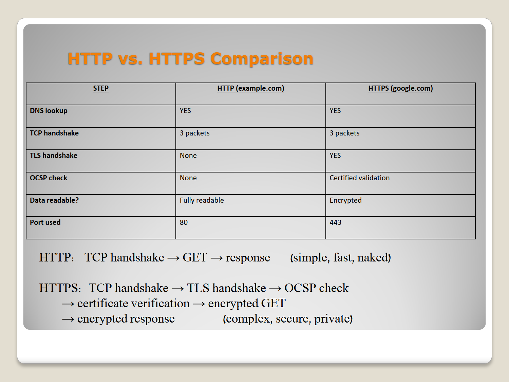

# Network Protocols Analysis Portfolio: Deep Dive via Wireshark and CLI

> *"Network communications are not merely an assembly of theoretical rules; they are a living laboratory where every command leaves a distinct, undeniable digital footprint."*

This portfolio showcases an empirical investigation of real-world network traffic. The analysis spans from local IP address allocation and hardware mapping, through web transit mechanisms, up to the cryptographic evaluation of application-layer protocols. Every project was executed by triggering active commands via the Command-Line Interface (CLI) and capturing the resulting packets "red-handed" using **Wireshark Deep-Packet Inspection (DPI)**.

---

## 🏛️ Portfolio Architecture & Key Findings

The portfolio is structured into three dedicated labs mapped to the OSI model layers, utilizing visual packet evidence to illustrate core behaviors:

### 1️⃣ Project 1: The Lifecycle of DHCP, DNS, and ARP (Infrastructure & Troubleshooting)
**Core Thesis:** Resetting an interface state forces the endpoint to completely rebuild its logical identity, resolve baseline domain names, and map its local physical broadcast domain before any Layer 3 routing can occur.

#### 📊 Top Visual Findings from the Lab:

* **Phase A: DHCP DORA Process** By executing `ipconfig /renew`, the host broadcasts to locate an available DHCP server. This screenshot captures the standard four-stage handshake (Discover, Offer, Request, ACK) that establishes the host's IP identity:
  

* **Phase B: Hardware Address Resolution via ARP** Prior to forwarding packets to the default gateway, the host discovers the physical MAC address bound to the target gateway IP using an ARP broadcast request and receiving a dedicated Unicast reply:
  

* **Phase C: Domain Name Resolution (DNS)** Following a local cache clear (`/flushdns`), the system initiates a raw infrastructure query to the DNS server over UDP port 53 to resolve the necessary IPv4 and IPv6 target destination addresses:
  

🔍 **[View Full Documentation & PCAP Files for Project 1](./wireshark-labs/core-infrastructure-protocols/)**

---

### 2️⃣ Project 2: Network Transit Depth & Transport Layer Security (ICMP, TCP, HTTP/S, TLS, OCSP)
**Core Thesis:** Transitioning from cleartext HTTP to cryptographically secure HTTPS introduces architectural overhead and a higher packet count, but guarantees endpoint identity validation and complete data privacy.

#### 📊 Top Visual Findings from the Lab:

* **Phase A: TCP Handshake & TLS Encrypted Channel Establishment** Analysis of the core Three-Way Handshake (`SYN`, `SYN-ACK`, `ACK`) followed immediately by the cryptographic key exchange within the TLS Client Hello and Server Hello frameworks:
  

* **Phase B: Empirical Comparison Matrix - HTTP vs. HTTPS** A structured comparison tracking packet count differentials, certificate validity checks (OCSP), and payload readability constraints between the two web transit types:
  

* **Phase C: Path Analysis & Network Resilience (ICMP Ping & Tracert)** Monitoring Echo Request and Echo Reply sequences while calculating Time-To-Live (TTL) decrements to mathematically deduce the exact number of intermediate routing hops to the destination:
  

🔍 **[View Full Documentation & PCAP Files for Project 2](./wireshark-labs/web-transit-protocols/)**

---

### 3️⃣ Project 3: Cryptographic Evaluation of Application Protocols (FTP vs. SFTP, SSH, Telnet, NTP)
**Core Thesis:** Legacy application protocols expose sensitive operational commands and credentials in plain text over the wire, underscoring the modern security mandate to migrate exclusively to high-entropy, binary encrypted streams like SSH and SFTP.

#### 📊 Top Visual Findings from the Lab:

* **Phase A: Plaintext Credential Exposure in FTP** Demonstrating how the FTP protocol transmits authorization primitives (`USER` and `PASS`) unencrypted, allowing instant