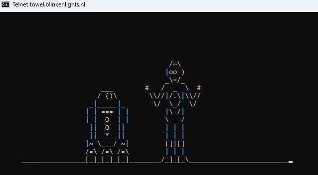
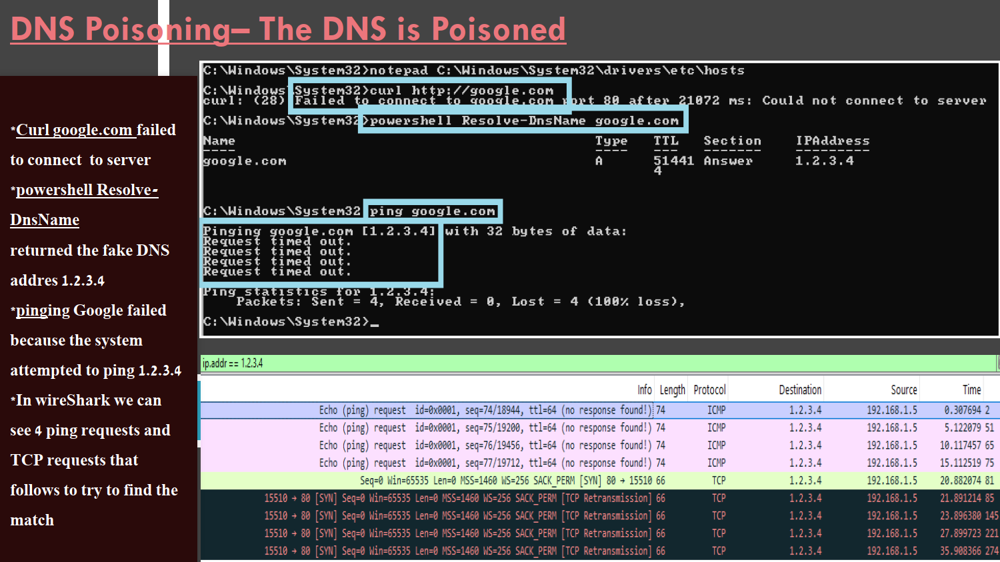
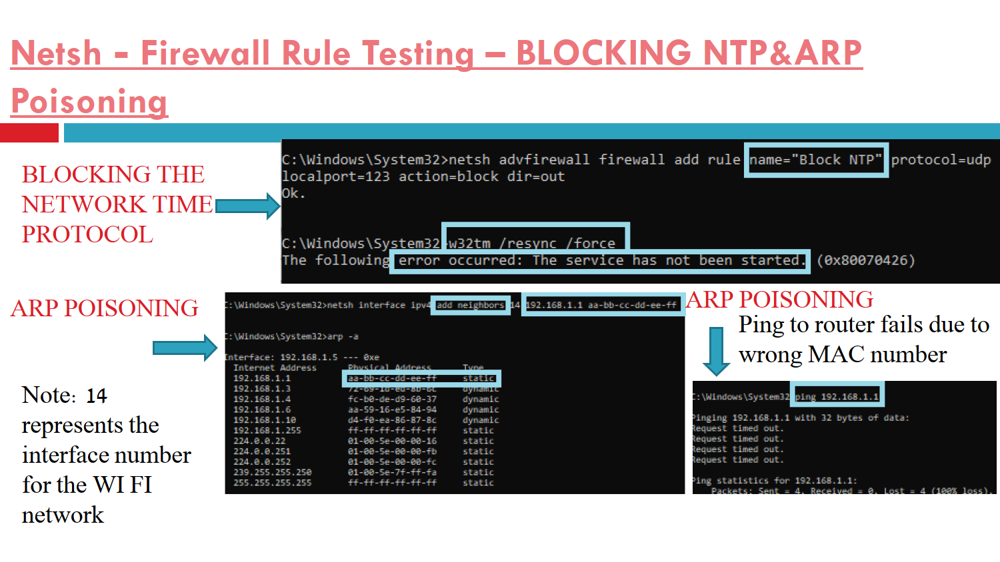
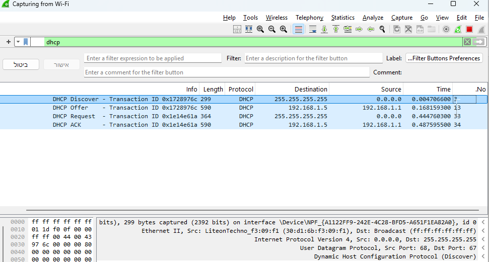
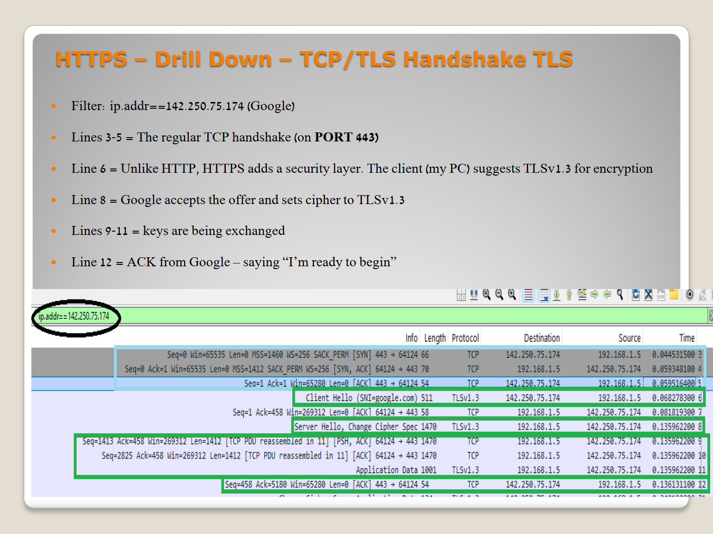
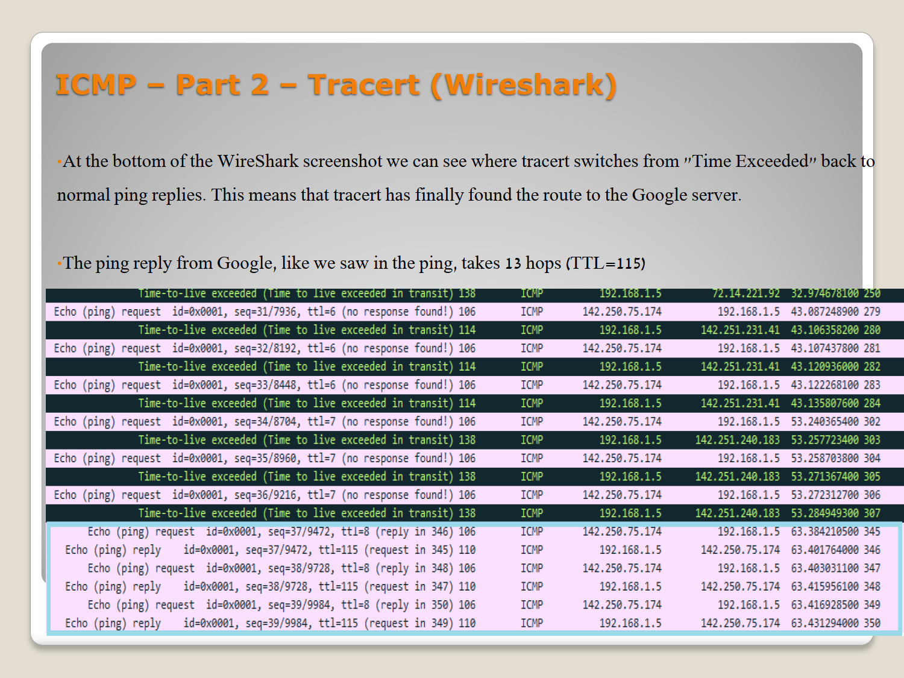
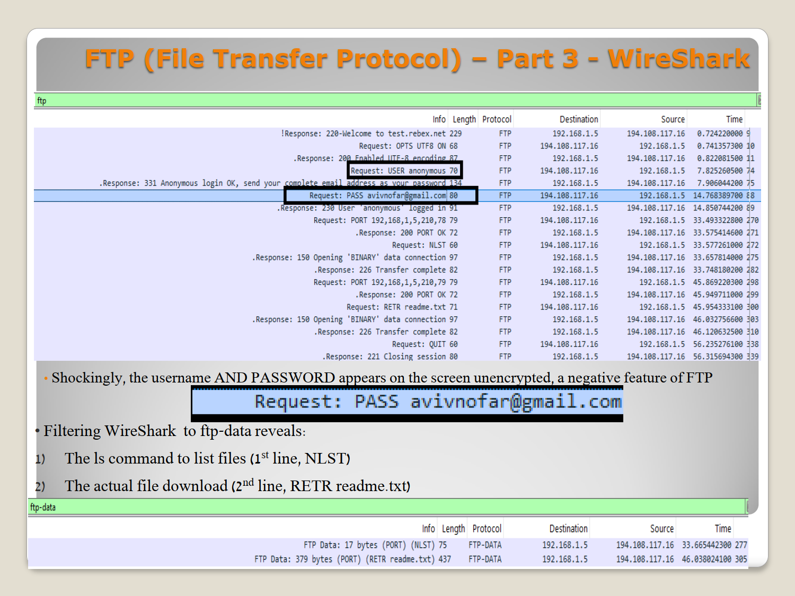

# Network Protocols Analysis Portfolio — Wireshark & CLI Deep Dive

> *"Network communications are not merely an assembly of theoretical rules — they are a living laboratory where every command leaves a distinct, undeniable digital footprint."*

This portfolio documents hands-on network analysis across four progressive labs. Each project uses CMD commands to deliberately trigger network activity, then captures the resulting packets live using **Wireshark Deep-Packet Inspection (DPI)**. The labs are ordered chronologically — from foundational infrastructure through active attack and defense simulation.

---

## 📂 Portfolio Structure

| # | Project | Focus Area |
|---|---|---|
| 1️⃣ | [DHCP, DNS & ARP Lifecycle](#1️⃣-project-1-dhcp-dns--arp-lifecycle) | Infrastructure & IP identity |
| 2️⃣ | [Network Transit & Transport Security](#2️⃣-project-2-network-transit--transport-layer-security) | ICMP, TCP, HTTP/S, TLS |
| 3️⃣ | [Secure vs. Insecure Protocols](#3️⃣-project-3-secure-vs-insecure-application-protocols) | FTP, SSH, Telnet, NTP |
| 4️⃣ | [**Network Attacks & Defense ← Latest**](#4️⃣-project-4-network-attacks--defense----latest) | ARP/DNS Poisoning, ICMP Flood, NMAP, netsh |

---

## 4️⃣ Project 4: Network Attacks & Defense — ⬅️ Latest

> **Simulating real-world network attacks using CMD and Wireshark, then defending with Windows Firewall (netsh).**

This is the most advanced lab in the portfolio. It shifts perspective from passive observation to active attack simulation — probing, flooding, poisoning, and manipulating the network using only built-in Windows tools, then capturing every result in Wireshark.

📄 **[View Full Presentation & PCAP Documentation](wireshark-labs/system-attacking-defending-methods/project-walkthrough.pdf)**

### Attack Categories

| Category | Techniques |
|---|---|
| **Network Overflow** | ARP Poisoning, ICMP Flood |
| **Server Disruption** | DNS Poisoning (hosts file), NTP Blocking |
| **Reconnaissance** | NMAP port scanning, TLS Certificate Inspection |
| **Firewall Manipulation** | netsh rules blocking HTTP, HTTPS, DNS, NTP, ARP |

---

### Phase A — ARP Poisoning

Injecting a fake MAC address into the ARP table to redirect traffic away from the real router. The key finding: `arp -s` without specifying an interface applies to whichever adapter Windows picks — in this case the VirtualBox adapter instead of Wi-Fi. Using `netsh interface ipv4 add neighbors 14` targets the correct interface precisely.

---

### Phase B — DNS Poisoning

Editing the Windows hosts file to redirect `google.com` to a fake IP (`1.2.3.4`), then confirming the poison across three tools with different DNS behaviors:

- `nslookup` — bypasses the hosts file, returns the real IP
- `ping` — respects the hosts file, pings `1.2.3.4` with 100% loss
- `powershell Resolve-DnsName` — respects the hosts file, confirms `1.2.3.4`

The Wireshark DNS filter shows **nothing** — because the hosts file intercepted the lookup before any DNS packet was sent. The missing packet is itself the evidence.

---

### Phase C — NMAP Reconnaissance + netsh Firewall Blocking

NMAP maps the entire subnet, identifies open services on the router, and retrieves its full admin page HTML — a complete target profile before any attack begins. The Wireshark capture shows thousands of TCP SYN packets firing in milliseconds — the unmistakable signature of a port scan.

Then netsh systematically blocks HTTP, HTTPS, NTP, DNS, and ARP on specific interfaces and ports — demonstrating the `remoteport` vs `localport` distinction that determines whether a rule actually fires.

🔍 **[View Full Documentation for Project 4](wireshark-labs/system-attacking-defending-methods/)**

---
---

## 1️⃣ Project 1: DHCP, DNS & ARP Lifecycle

**Core idea:** Resetting a network interface forces the endpoint to completely rebuild its IP identity from scratch — and Wireshark catches every step of that process.

### Phase A — DHCP DORA

Running `ipconfig /release` followed by `ipconfig /renew` triggers the full four-step DHCP handshake: Discover → Offer → Request → ACK. A prior `/renew` on the same IP skips straight to Request, producing only 2 packets instead of 4.

### Phase B — ARP & DNS

Before any packet can leave the subnet, the host resolves the router's MAC address via ARP broadcast. After a `/flushdns` cache clear, a fresh DNS query over UDP port 53 resolves the target domain.

🔍 **[View Full Documentation for Project 1](wireshark-labs/core-infrastructure-protocols/)**

---

## 2️⃣ Project 2: Network Transit & Transport Layer Security

**Core idea:** Moving from HTTP to HTTPS adds a full TLS negotiation layer — more packets, but guaranteed identity verification and encrypted payloads.

### Phase A — TCP Handshake & TLS

The three-way handshake (SYN → SYN-ACK → ACK) establishes the connection. HTTPS then adds a TLS Client Hello / Server Hello / Key Exchange sequence before a single byte of application data is sent.

### Phase B — ICMP Ping & Tracert

`ping` reveals TTL decrements and round-trip times. `tracert` uses deliberately low TTL values to map every router hop — with Wireshark showing the `Time Exceeded` responses that reveal each hop's IP. The outbound path (8 hops) differs from the inbound path (13 hops) — asymmetric routing in action.

🔍 **[View Full Documentation for Project 2](wireshark-labs/web-transit-protocols/)**

---

## 3️⃣ Project 3: Secure vs. Insecure Application Protocols

**Core idea:** Legacy protocols (FTP, Telnet) send everything in plain text. Their modern replacements (SFTP, SSH) encrypt the same data completely. Wireshark makes this contrast impossible to argue with.

### Phase A — FTP vs SFTP

FTP transmits `USER` and `PASS` in fully readable plain text — visible to anyone on the same network. SFTP sends the same credentials over SSH, producing only encrypted binary blocks in Wireshark.

### Phase B — Telnet vs SSH

A Telnet connection to `towel.blinkenlights.nl` streams the Star Wars ASCII animation as fully readable plain text. The same remote connection over SSH produces nothing readable — the Diffie-Hellman key exchange is visible, but everything after `New Keys` is encrypted.

🔍 **[View Full Documentation for Project 3](wireshark-labs/secure-vs-insecure-protocols/)**

---

## 🛠️ Tools Used

| Tool | Purpose |
|---|---|
| **Wireshark** | Live packet capture, display filters, protocol dissection |
| **Windows CMD** | `ipconfig`, `ping`, `tracert`, `arp`, `curl`, `netstat`, `w32tm` |
| **nmap 7.80** | Network discovery and port/service scanning |
| **netsh advfirewall** | Windows firewall rule creation and manipulation |
| **FTP / SSH / Telnet clients** | Protocol comparison and credential exposure testing |

---

> ⚠️ All attacks were performed on a personal local network in a controlled lab environment. No external systems were targeted. This portfolio is for educational purposes in the context of network security learning.
