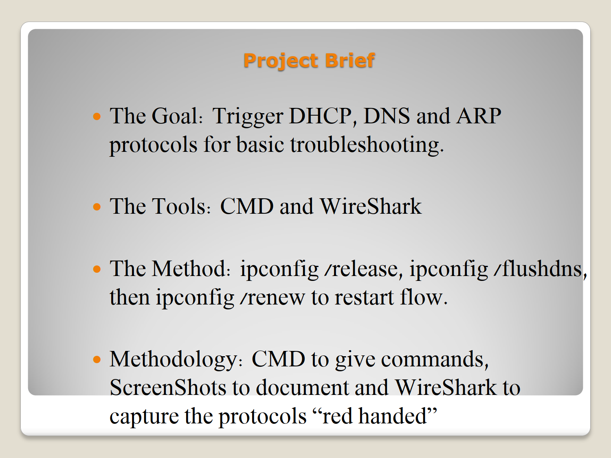
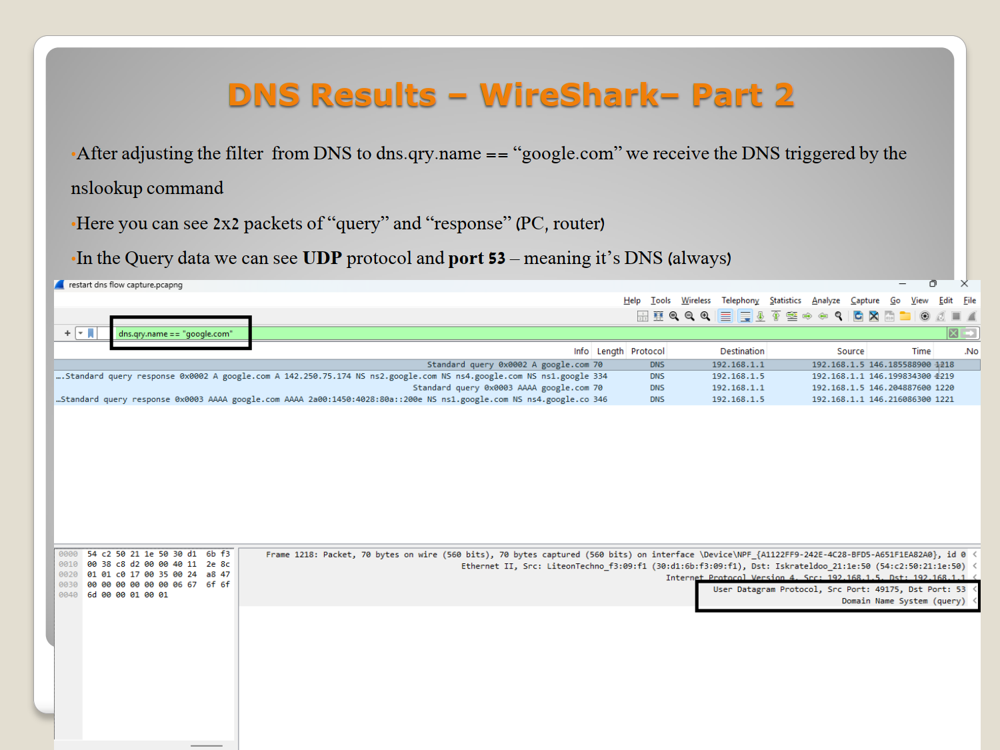
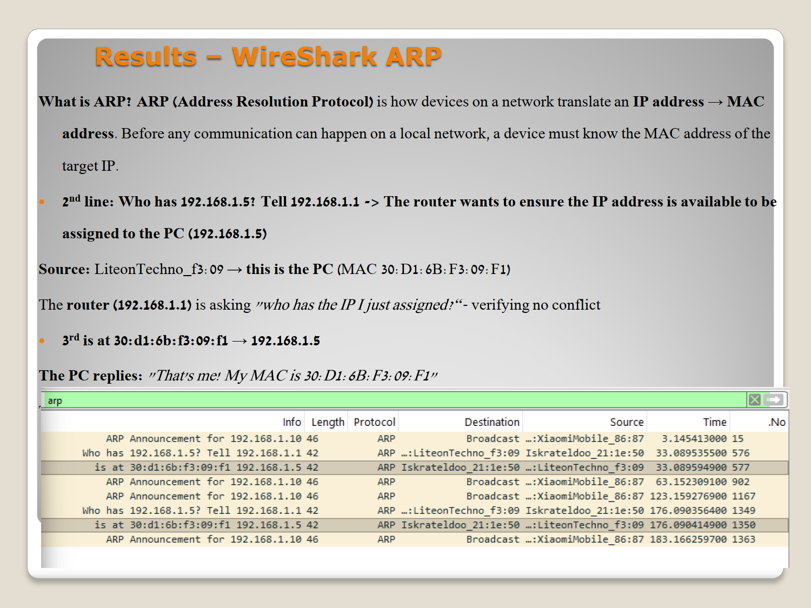

# Network Protocol Analysis Portfolio: A Deep-Dive Wireshark & CLI Examination


## Project Overview
Welcome to my Network Analysis Portfolio. This repository serves as an advanced, empirical study of network protocols across the OSI model layers. The core methodology follows a rigorous experimental approach: leveraging the Windows Command Line (CLI) to orchestrate real-world network actions and utilizing **Wireshark Deep-Packet Inspection (DPI)** to capture, parse, and analyze the underlying network traffic "red-handed."

Rather than treating protocols as theoretical abstractions, this portfolio treats the live network as a laboratory—testing hypotheses about protocol behavior, timing, architectural overhead, and cryptographic states.

---

## Portfolio Narrative Arc
The repository is structured into three progressive labs, moving from basic link and local infrastructure provisioning up to application-layer security eva# Part 1: Core Network Troubleshooting & Infrastructure Provisioning (DHCP, DNS, ARP)

## 🧪 Experimental Thesis
When a local network host experiences an interface state reset, it must systematically rebuild its logical identity, resolve baseline names, and map its physical broadcast domain before any external Layer 3 routing can take place. This lab triggers a controlled network lease eviction to capture and analyze this foundational initialization sequence.

---

## 🛠️ Methodology & Environment Triggers
Using an administrative Windows Command Prompt, the local host cache and interface environments were completely flushed and renewed while Wireshark captured live traffic on the active interface:

1. **Eviction:** `ipconfig /release` — Relinquishes the current IPv4 lease, dropping connectivity and setting the interface address to `0.0.0.0`.
2. **Purge:** `ipconfig /flushdns` — Flushes the local DNS Resolver Cache to force active outbound resolution.
3. **Reconstitution:** `ipconfig /renew` — Triggers an immediate multi-protocol discovery sequence to acquire a new lease, resolve authoritative gateways, and populate local tables.



---

## 🔍 Deep-Packet Inspection & Architectural Analysis

### 1. The DHCP DORA Cycle (`bootp` / `dhcp`)
The execution of `ipconfig /renew` initiates the 4-stage **DORA** transaction. Since the client begins with no valid logical identity, it leverages Layer 2 and Layer 3 broadcasts to discover provisioning infrastructure:

* **Discover:** Sent from source IP `0.0.0.0` to broadcast address `255.255.255.255` over UDP Port 67. This packet searches for any available DHCP Server within the broadcast domain.
* **Offer:** The local DHCP Server (typically the home gateway) responds with a proposed IP address configuration, subnet mask, lease duration, and gateway address.
* **Request:** The client broadcasts back, explicitly stating its intent to accept the configuration offered by that specific server.
* **ACK (Acknowledgment):** The server commits the lease to its database and sends a final confirmation to the client, activating the logical interface.


### 2. DNS Resolution Sequence (`dns`)
With a fresh lease assigned, background applications and system components immediately issue outbound DNS requests. Because the local DNS cache was completely purged via `/flushdns`, Windows cannot read from local RAM; it is forced to construct a raw DNS Query packet directed at the newly assigned DNS server over UDP port 53.
* *Packet Inspection Details:* The capture isolates standard queries (Type A for IPv4, Type AAAA for IPv6) followed by authoritative server responses detailing the target domain's public IPs.



### 3. ARP Hardware Address Mapping (`arp`)
Before the host can send an IP packet to its local gateway or any peer on the subnet, it knows the logical target IP but lacks the destination destination hardware address (MAC). It triggers an Address Resolution Protocol (ARP) Request:
* **The Broadcast:** The packet is sent to the broadcast MAC address `ff:ff:ff:ff:ff:ff` asking: *"Who has 192.168.1.1? Tell 192.168.1.X"*.
* **The Reply:** The gateway intercepts the broadcast and returns a unicast ARP Reply stating its exact physical MAC address, allowing the host to build its local L2 frame headers and populate its local ARP table.



---

## 💡 Key Takeaway
This lab demonstrates that "getting internet" is not a single event but a tightly orchestrated cascade. Without the successful completion of the **L2 ARP broadcast**, the host remains blind inside its local domain. Without **DHCP**, it remains stateless. Without **DNS**, it remains isolated from the human-readable web.
1. **[Part 1: Core Network Troubleshooting & Infrastructure (DHCP, DNS, ARP)](./wireshark-labs/core-infrastructure-protocols/)**
   * *The Thesis:* Restatements of local network interfaces force deterministic state-reconfiguration sequences through discovery and provisioning protocols.
2. **[Part 2: Web Transit Mechanics & Transport Layer Security (ICMP, TCP, HTTP/S, TLS, OCSP)](./wireshark-labs/web-transit-protocols/)**
   * *The Thesis:* Transitioning from cleartext web delivery to encrypted application transit imposes measurable architectural overhead but establishes critical cryptographic assurance.
3. **[Part 3: Cryptographic Evaluation of Application Protocols (FTP, SFTP, SSH, Telnet, NTP)](./wireshark-labs/secure-vs-insecure-protocols/)**
   * *The Thesis:* Legacy application-layer protocols expose raw payloads to trivial sniffing vectors, demanding a complete migration to high-entropy encrypted binary streams.

---

## Directory Structure
```text
network-analysis-portfolio/
│
├── images/
│
├── wireshark-labs/
│   ├── core-infrastructure-protocols/     # Part 1: DHCP, DNS, ARP
│   │   ├── captures/                      # Live PCAPNG captures
│   │   ├── screenshots/
│   │   │   └── RM_resources/              # Documented screenshots for README
│   │   └── README.md
│   │
│   ├── web-transit-protocols/             # Part 2: ICMP, TCP, HTTP, HTTPS, TLS, OCSP
│   │   ├── captures/                      # Live PCAPNG captures
│   │   ├── screenshots/
│   │   │   └── RM_resources/              # Documented screenshots for README
│   │   └── README.md
│   │
│   └── secure-vs-insecure-protocols/      # Part 3: FTP, SFTP, SSH, Telnet, NTP
│       ├── captures/                      # Live PCAPNG captures
│       ├── screenshots/
│       │   └── RM_resources/              # Documented screenshots for README
│       └── README.md
│
└── README.md                              # This Master File