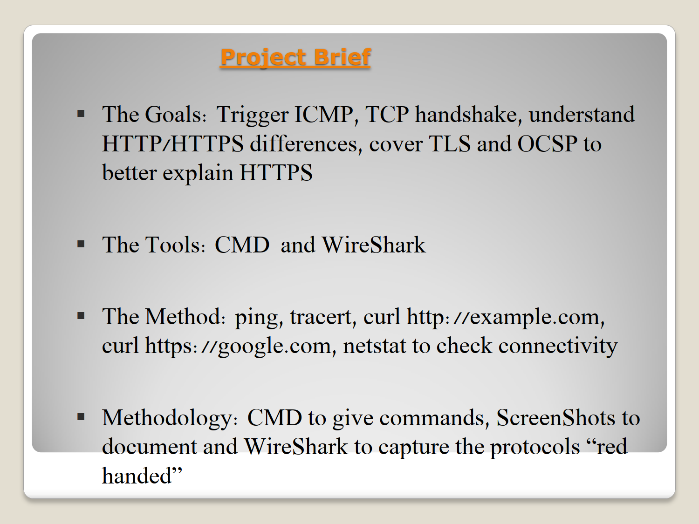

# Part 2: Web Transit Mechanics & Transport Layer Security (ICMP, TCP, HTTP/S, TLS, OCSP)

## 🧪 Experimental Thesis
The human web experience relies on a structural paradox: Application data must be delivered with absolute reliability and end-to-end confidentiality, yet the underlying network layer is inherently unreliable and public. This lab analyzes the performance and architectural differences between simple, naked transport streams (ICMP/HTTP) and complex, cryptographically wrapped application tunnels (HTTPS/TLS).

---

## 🛠️ Methodology & Environment Triggers
The host targeted public web endpoints using administrative commands to trigger specific layer interaction:
1. `ping google.com` — Generates raw ICMP control traffic to test Layer 3 reachability.
2. `tracert google.com` — Incrementally drops IP Time-to-Live metrics to map intermediate routed hops.
3. `curl http://example.com` — Generates a standard unencrypted Layer 7 HTTP session.
4. `curl https://google.com` — Initiates an encrypted Layer 7 HTTPS session wrapped in a TLS tunnel.
5. `netstat -an` — Captures a static snapshot of all active, open, and terminating TCP sockets on the local machine.

---

## 🔍 Deep-Packet Inspection & Architectural Analysis

### 1. ICMP Diagnostic Flow & TTL Calculus (`icmp`)
When pinging `google.com`, the host transmits a series of 32-byte ICMP Echo Requests. 
* **The TTL Phenomenon:** The baseline default TTL for Windows outbound IP packets is `128`. Upon capturing Google's incoming Echo Reply packets, the Wireshark inspection reveals an arriving `TTL = 115`. 
* **The Math:** Knowing that every Layer 3 router decrements the TTL field by exactly 1 to prevent infinite routing loops, we calculate: `128 - 115 = 13`. The packets traversed exactly **13 network hops** to reach Google's server and return.

### 2. The TCP Three-Way Handshake (`tcp`)
Before any HTTP or HTTPS application payload can stream, TCP must establish a reliable, stateful virtual circuit. Wireshark captures this "red-handed" via flag transitions:
1. `[SYN]`: Client sends an initial Sequence Number ($Seq=0$ relative).
2. `[SYN-ACK]`: Server acknowledges the client ($Ack=1$) and provides its own Sequence Number.
3. `[ACK]`: Client acknowledges the server ($Seq=1$, $Ack=1$). The pipe is open.

### 3. HTTP Cleartext vs. HTTPS/TLS Cryptographic Overhead
Executing `curl http://example.com` reveals a rapid, raw process: Handshake -> Plaintext `GET / HTTP/1.1` -> Plaintext `HTTP/1.1 200 OK` Response. The payload is entirely readable within Wireshark's packet bytes pane.

Conversely, `curl https://google.com` triggers a massive structural evolution:
* **The TLS Handshake:** Following the TCP handshake, a multi-packet cryptographic dance occurs: *Client Hello* (offering ciphers) -> *Server Hello* (selecting ciphers and presenting Google's SSL Certificate) -> *Key Exchange* (establishing ephemeral symmetric keys).
* **OCSP Certificate Validation:** Wireshark captures automated sub-requests checking Online Certificate Status Protocol (OCSP). The browser automatically contacts the Certificate Authority (CA) to ask: *"Is this Google certificate still valid or has it been revoked?"* before passing data.

### 📊 Structural Comparison Matrix
| Architectural Step | HTTP (`example.com`) | HTTPS (`google.com`) |
| :--- | :---: | :---: |
| **DNS Lookup** | Yes | Yes |
| **TCP Handshake** | 3 Packets | 3 Packets |
| **TLS Cryptographic Tunnel** | ❌ None | **Yes (Client/Server Hello)** |
| **Identity & Revocation Check** | ❌ None | **Yes (OCSP Validation)** |
| **Data Payload Visibility** | **Fully Readable (Cleartext)** | **Fully Encrypted (Ciphertext)** |
| **Target Port Destination** | Port 80 | Port 443 |

### 4. Socket State Analysis via `netstat`
Running `netstat -an` exposes the ephemeral lifecycle of these connections. Connections to Google's servers appear in a `TIME_WAIT` state. This is an intentional TCP mechanism: the local OS holds the socket open briefly after close to absorb any stray, delayed packets still traveling across the internet, preventing socket reuse corruption.

---

## 💡 Key Takeaway
Security introduces complexity. While HTTP completes its transaction in milliseconds over a single naked TCP pipe, HTTPS demands mathematical verification, certificate chain checks, and real-time revocation validations. In modern engineering, this minor performance overhead is non-negotiable for ensuring absolute user privacy.