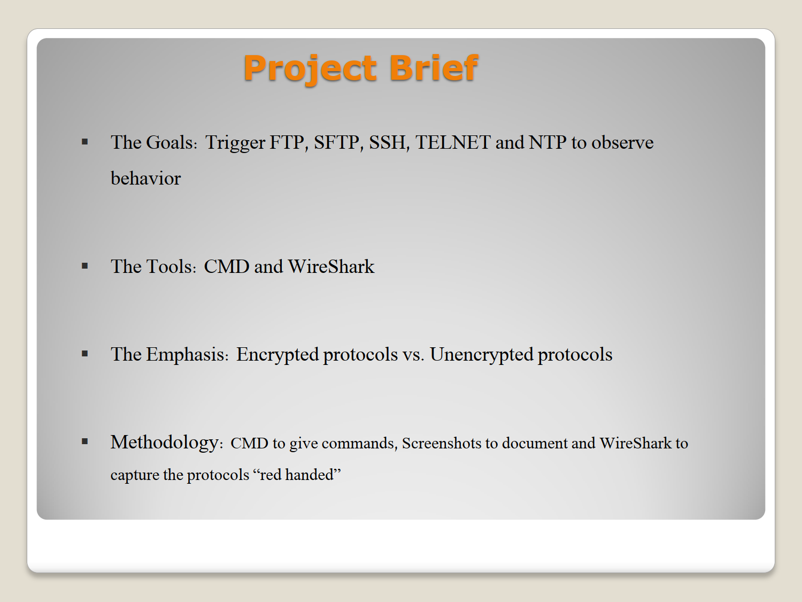
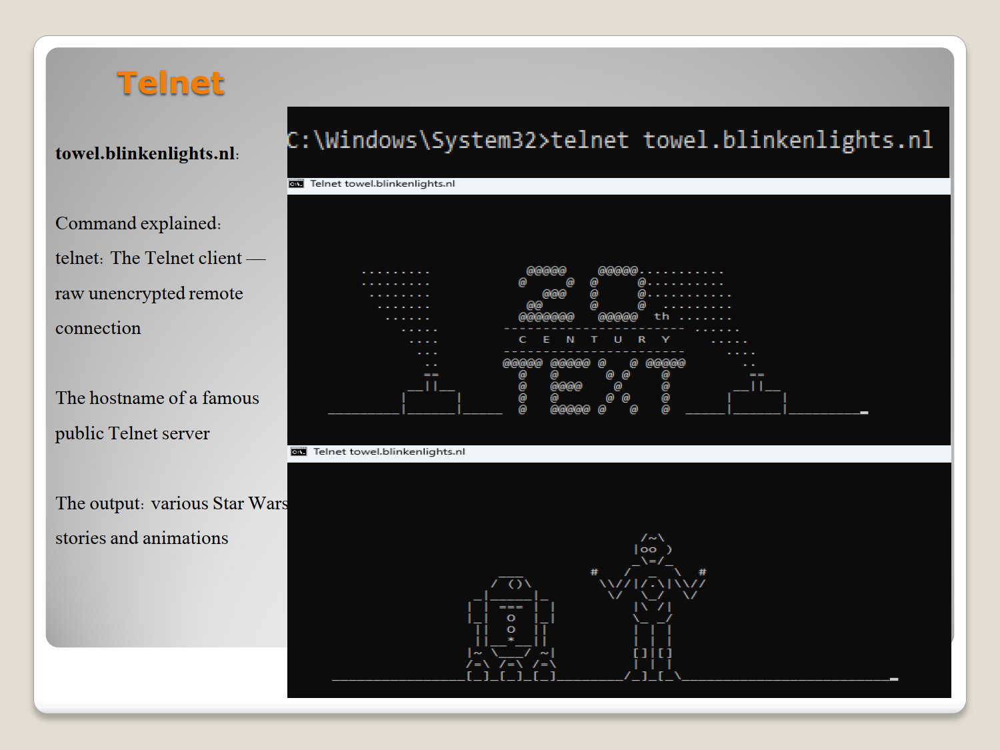
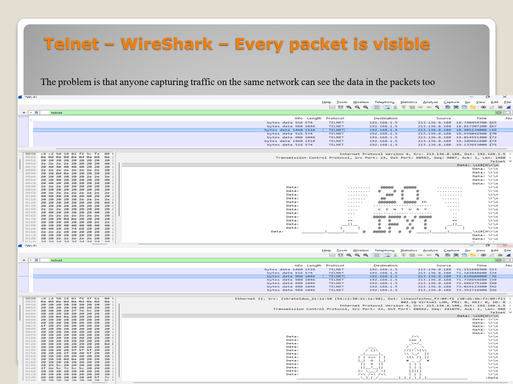
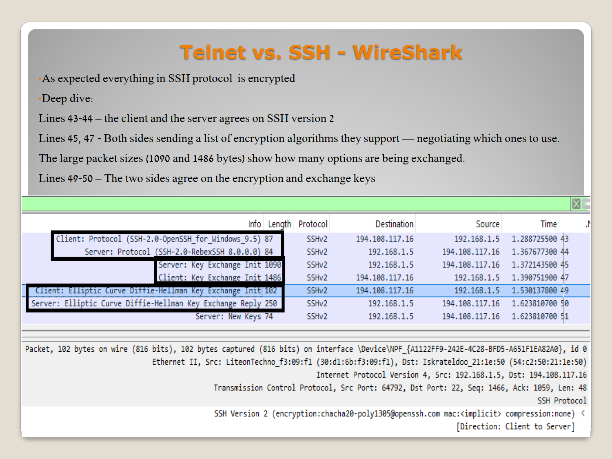

# Part 3: Cryptographic Evaluation of Application Protocols (FTP vs. SFTP/SSH, Telnet, NTP)

## 🧪 Experimental Thesis
Application layer protocols designed in the early eras of networking prioritized functional simplicity over cryptographic isolation. In a modern threat landscape, running these legacy protocols is an active vulnerability. This lab sets up explicit sessions with remote terminal, file transfer, and time endpoints to contrast unencrypted cleartext protocols against high-entropy secure alternatives.

---

## 🛠️ Methodology & Environment Triggers
Using built-in Windows network engines and custom clients, sessions were initiated while Wireshark recorded the wire:
1. `ftp test.rebex.net` — Connects to a public test file server using unencrypted FTP.
2. `telnet towel.blinkenlights.nl` — Opens a legacy plaintext terminal session to stream a custom text animation.
3. `ssh` / `sftp` — Connects to a secure encrypted shell/file infrastructure (running over Port 22).
4. `w32tm /resync` — Forces an administrative Windows Time synchronization over Network Time Protocol (NTP).

---

## 🔍 Deep-Packet Inspection & Cryptographic Breakdown

### 1. The Anatomy of an FTP Compromise (`ftp`)
Connecting to `test.rebex.net` as `anonymous` with an email address password exposes the critical vulnerability of FTP (Port 21). 
* **The Sniffing Demonstration:** Because FTP transmits both control commands and data sessions in cleartext, searching for the string filter `ftp` in Wireshark immediately exposes the authentication handshake.
* *Packet Inspection Details:* Wireshark captures Command `USER anonymous` (Response `331 Anonymous login OK`) and the subsequent `PASS` command containing the exact, unencrypted email address entered. Directory listings (`ls`) and file data payloads (`get readme.txt`) are fully reconstructed from raw TCP streams with zero decoding required.

### 2. Telnet Plaintext Streaming vs. SSH Binary Isolation
Executing `telnet towel.blinkenlights.nl` opens an unencrypted ASCII stream over Port 23. The server begins streaming an animation of Star Wars in pure text format.
* **The Telnet Visual Exposure:** Inspecting the raw Wireshark data packets or selecting "Follow TCP Stream" allows an observer to read the exact text characters forming the animation frames directly from the wire. Every keystroke and server character arrives naked.

* **The SSH/SFTP Countermeasure (Port 22):** Initiating an SSH/SFTP session presents a completely different packet footprint. Following the initial TCP handshake, Wireshark captures an `SSH_MSG_KEXINIT` exchange where both sides negotiate cryptographic algorithms (e.g., AES-GCM, Diffie-Hellman key exchange). 
* Once the keys are established, **every subsequent packet appears as high-entropy pseudo-random binary data**. There are no readable words, no usernames, and no commands. The data stream is mathematically unreadable to unauthorized collectors.

### 3. NTP Infrastructure Synchronization (`ntp`)
To maintain cross-domain log accuracy and prevent authentication replays, system times must remain synchronous. The `w32tm /resync` command forces an outbound request over **NTP (UDP Port 123)**.
* **Packet Footprint:** NTP operates purely over UDP for speed. Wireshark captures a simple, highly precise packet structure detailing root delay, root dispersion, and reference timestamps accurate to fractions of a millisecond.

---

## 🔬 Protocol Security Matrix (Definitive Portfolio Conclusion)
| Protocol Name | Default Destination Port | Transport Protocol | Cryptographic Protection | Vulnerable to Sniffing? |
| :--- | :---: | :---: | :---: | :---: |
| **Telnet** | 23 | TCP | ❌ None (Cleartext) | 🔴 **YES** |
| **SSH** | 22 | TCP |  Asymmetric Key / Symmetric Cipher | 🟢 NO |
| **FTP** | 21 | TCP | ❌ None (Cleartext) | 🔴 **YES** |
| **SFTP** | 22 | TCP |  SSH Cryptographic Wrapper | 🟢 NO |
| **HTTP** | 80 | TCP | ❌ None (Cleartext) | 🔴 **YES** |
| **HTTPS** | 443 | TCP |  TLS / Cert Validation | 🟢 NO |
| **NTP** | 123 | UDP | ❌ None (Baseline Mode) | 🟡 Payload Visible (Time Only) |

---

## 📑 Portfolio Conclusion
This rigorous multi-part lab structure proves that modern network administration requires deep-packet consciousness. By watching protocols transition from discovery (Part 1), through transit (Part 2), to cryptographic isolation (Part 3), this portfolio establishes a robust, engineering-focused understanding of active network communication mechanics.