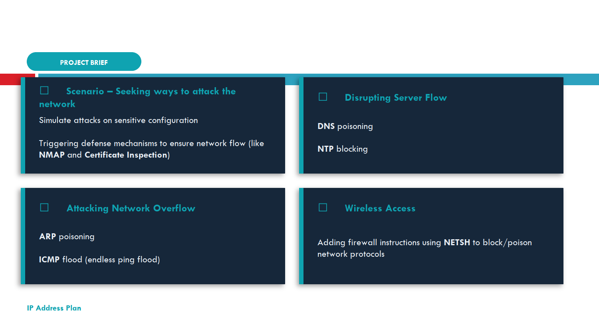
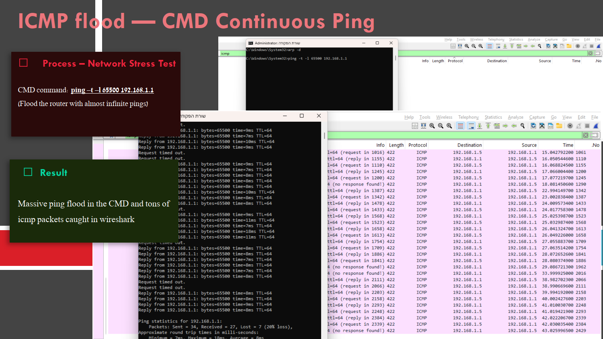
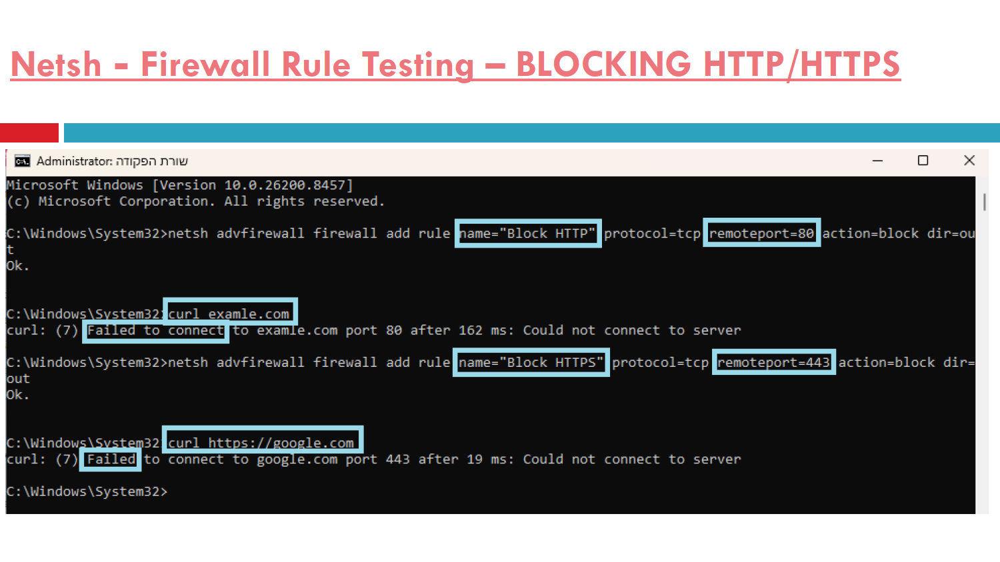

# 🛡️ Network Attacks & Defense — Wireshark Lab

> **Simulating real-world network attacks using CMD commands, capturing results live in Wireshark, and defending with Windows Firewall (netsh).**

📄 **[View Full Presentation (PDF)](C:\Users\97252\GITHUB\network-analysis-portfolio\wireshark-labs\system-attacking-defending-methods\project-walkthrough.pdf)**

---

## 📋 Project Overview

This lab simulates a threat actor probing and attacking a live network from within — using only built-in Windows tools and Wireshark. Every attack is triggered via CMD, captured in Wireshark, and then defended or cleaned up.

The project is structured around four attack categories:

| Category | Techniques Used |
|---|---|
| **Attacking Network Overflow** | ARP Poisoning, ICMP Flood |
| **Disrupting Server Flow** | DNS Poisoning (hosts file), NTP Blocking |
| **Reconnaissance** | NMAP scanning, Certificate Inspection (OCSP) |
| **Firewall Manipulation** | netsh rules to block/poison HTTP, HTTPS, DNS, NTP, ARP |

---

## 🗂️ Project Structure

```
system-attacking-defending-methods/
├── screenshots/
│   └── RM_resources/          ← all screenshots used in this README
├── project-walkthrough.pdf    ← full slide presentation
└── README.md
```

---

## ⚔️ Attack 1 — ARP Poisoning

**Goal:** Corrupt the ARP table to redirect traffic to a fake MAC address.

**Commands used:**
```cmd
arp -a                                              # view legitimate ARP table
arp -s 192.168.1.1 aa-bb-cc-dd-ee-ff               # inject fake MAC (arp -s method)
netsh interface ipv4 add neighbors 14 192.168.1.1aa-bb-cc-dd-ee-ff   # targeted Wi-Fi interface
arp -a                                              # verify poison applied
ping 192.168.1.1                                    # confirm traffic fails
arp -d                                              # clean up
```



**Key finding:** Using `arp -s` without specifying an interface applies the poison to whichever interface Windows selects — in this case the VirtualBox adapter instead of Wi-Fi. Using `netsh interface ipv4 add neighbors 14` targets the correct Wi-Fi interface (index 14 = `0xe` from `arp -a`).

**What Wireshark shows:** Gratuitous ARP announcements from devices on the network — the same packet structure an attacker broadcasts to poison everyone's ARP tables simultaneously.

---

## 🌊 Attack 2 — ICMP Flood (DoS Simulation)

**Goal:** Overwhelm the router with maximum-size ping packets.

**Command used:**
```cmd
ping -t -l 65500 192.168.1.1
```



**Results:**
- **Packets sent:** continuous stream at 65,500 bytes each (~500x normal ping size)
- **Packet loss:** 20% — router CPU struggling to respond
- **Wireshark:** hundreds of ICMP packets per second, some showing `(no response found!)`

**What this demonstrates:** Normal `ping` uses 32 bytes. This flood uses 65,500 bytes — the maximum ICMP payload. In Wireshark, a flood looks unmistakably different from normal traffic: a wall of ICMP packets with no gaps.

---

## ☠️ Attack 3 — DNS Poisoning

**Goal:** Redirect google.com to a fake IP address using the Windows hosts file.

### Step 1 — Detection Method (Standard DNS)

First, querying three independent DNS servers to establish a baseline and demonstrate the detection technique:

```cmd
ipconfig /flushdns
nslookup google.com 8.8.8.8       # Google's DNS
nslookup google.com 1.1.1.1       # Cloudflare's DNS
nslookup google.com 192.168.1.1   # Router's DNS
```


| DNS Server | Result | Status |
|---|---|---|
| 8.8.8.8 | 142.250.75.78 | ✅ Normal |
| 1.1.1.1 | 142.250.75.174 | ✅ Normal |
| 192.168.1.1 | 142.250.75.110 | ✅ Normal |

All three return different IPs in the `142.250.75.x` range — Google's load balancing. If one server returned a completely different IP range, it would be poisoned.

### Step 2 — Poisoning via Hosts File

```
C:\Windows\System32\drivers\etc\hosts
→ Added: 1.2.3.4    google.com
```

### Step 3 — Confirmed Poisoned

```cmd
curl http://google.com          # Failed to connect to port 80
powershell Resolve-DnsName google.com   # Returned 1.2.3.4
ping google.com                 # Pinging [1.2.3.4] — 100% loss
```

**Wireshark filter:** `ip.addr == 1.2.3.4`

Shows 4 ICMP requests with `[No response seen]` and TCP SYN retransmissions with exponential backoff — the browser silently trying to reach the fake IP and giving up.

**Critical insight:** The DNS filter shows **nothing** — because the hosts file intercepted the lookup before any DNS packet was sent. The absence of a DNS packet is itself the evidence.

---

## 🔍 Attack 4 — NMAP Port Scanning

**Goal:** Map the network and identify open services on the router — the first step of any real attack.

**Commands used:**
```cmd
nmap -sn 192.168.1.0/24          # discover all live hosts
nmap -sV 192.168.1.1             # service version detection
nmap -p 80,443,22,21 192.168.1.1 # targeted port scan
```


**Results:**
```
PORT     STATE     SERVICE
21/tcp   filtered  ftp       ← firewall blocking
22/tcp   filtered  ssh       ← firewall blocking
80/tcp   open      http      ← router admin panel accessible
443/tcp  open      https     ← router secure admin accessible
```

`nmap -sV` retrieved the **full HTML of the router admin page** including firmware version and license status — a complete target profile in one command.

**Wireshark filter:** `tcp.flags.syn==1 && !tcp.flags.ack==1`

Shows thousands of SYN packets firing at every port in milliseconds — the unmistakable visual signature of a port scan. Each open port responds with SYN-ACK; closed ports respond with RST; filtered ports respond with nothing.

---

## 🔐 Attack 5 — HTTPS Certificate Inspection (OCSP)

**Goal:** Expose the TLS certificate exchange and security headers that happen invisibly on every HTTPS connection.

**Command used:**
```cmd
curl -v https://google.com 2>&1
```

**What `-v` reveals:**
```
ALPN negotiation        → http/1.1 agreed
SSL/TLS renegotiation   → mid-session upgrade
HTTP/1.1 301            → forced HTTPS redirect
Content-Security-Policy → XSS prevention headers
X-Frame-Options         → clickjacking prevention
Alt-Svc: h3=":443"      → HTTP/3 (QUIC) advertised
```

**Wireshark filter:** `tls.handshake.type == 11`

Captures the Certificate message from `13.89.179.13` (Microsoft's OCSP server) — Windows silently checking Google's certificate validity. TTL=108 reveals this server is 20 hops away, on a completely different network path than Google.

---

## 🔒 Attack 6 — netsh Firewall Manipulation

**Goal:** Use Windows' built-in firewall tool to block, poison, and disrupt network protocols.

### ICMP Block
```cmd
netsh advfirewall firewall add rule name="Block ICMP" protocol=icmpv4:8,any action=block dir=out
ping 192.168.1.1    # General failure — ICMP blocked ✅
netsh advfirewall firewall delete rule name="Block ICMP"
ping 192.168.1.1    # Restored ✅
```

### HTTP & HTTPS Block



```cmd
netsh advfirewall firewall add rule name="Block HTTP" protocol=tcp remoteport=80 action=block dir=out
curl http://example.com     # curl: (7) Failed to connect to port 80 ✅

netsh advfirewall firewall add rule name="Block HTTPS" protocol=tcp remoteport=443 action=block dir=out
curl https://google.com     # curl: (7) Failed to connect to port 443 ✅
```

> ⚠️ **Important:** Use `remoteport` not `localport` — HTTP/HTTPS traffic goes TO port 80/443 on the server. Your PC's source port is always a random high number.

### NTP Block + ARP Poisoning via netsh


```cmd
# Block NTP
netsh advfirewall firewall add rule name="Block NTP" protocol=udp localport=123 action=block dir=out
w32tm /resync /force    # Error: The service has not been started ✅

# ARP poison on correct Wi-Fi interface (index 14)
netsh interface ipv4 add neighbors 14 192.168.1.1 aa-bb-cc-dd-ee-ff
arp -a                  # 192.168.1.1 → aa-bb-cc-dd-ee-ff (static) ✅
ping 192.168.1.1        # Request timed out — wrong MAC ✅
```

### DNS Block
```cmd
netsh advfirewall firewall add rule name="Block DNS" protocol=udp remoteport=53 action=block dir=out
ipconfig /flushdns
ping google.com         # Ping request could not find host google.com ✅
```

### Protocol Block Reference

| Protocol | Port | Type | Block Command |
|---|---|---|---|
| DNS | 53 | UDP | `protocol=udp remoteport=53` |
| HTTP | 80 | TCP | `protocol=tcp remoteport=80` |
| HTTPS | 443 | TCP | `protocol=tcp remoteport=443` |
| FTP | 21 | TCP | `protocol=tcp remoteport=21` |
| SSH | 22 | TCP | `protocol=tcp remoteport=22` |
| NTP | 123 | UDP | `protocol=udp localport=123` |
| ICMP | — | ICMP | `protocol=icmpv4:8,any` |
| RDP | 3389 | TCP | `protocol=tcp localport=3389 dir=in` |
| SMB | 445 | TCP | `protocol=tcp localport=445 dir=in` |

### Full Restore
```cmd
netsh advfirewall reset
```

---

## 🧰 Tools Used

| Tool | Purpose |
|---|---|
| **Wireshark** | Live packet capture and analysis |
| **CMD (Admin)** | Attack trigger commands |
| **nmap 7.80** | Network and port scanning |
| **netsh advfirewall** | Windows firewall rule manipulation |
| **curl** | HTTP/HTTPS requests and TLS inspection |
| **arp / nslookup / ping** | Network reconnaissance and verification |

---

## 📚 Key Concepts Demonstrated

- **ARP Poisoning** — corrupting MAC address tables to redirect traffic
- **ICMP DoS** — flooding a target with oversized ping packets
- **DNS Poisoning** — hosts file manipulation to redirect domain resolution
- **Port Scanning** — nmap reconnaissance revealing open services
- **TLS/OCSP** — certificate validation chain exposed via Wireshark
- **Firewall Evasion** — `localport` vs `remoteport` distinction in netsh rules
- **Interface Targeting** — using interface index to target specific network adapters

---

## ⚠️ Disclaimer

All attacks in this project were performed on a **personal local network** in a controlled lab environment. No external systems were targeted. This project is intended for **educational purposes** in the context of network security learning.

---

📄 **[View Full Slide Presentation (PDF)](C:\Users\97252\GITHUB\network-analysis-portfolio\wireshark-labs\system-attacking-defending-methods\project-walkthrough.pdf)**
